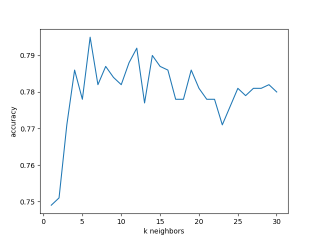
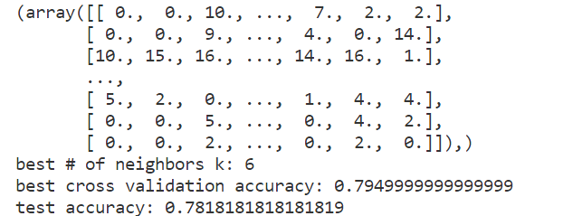

# KNN Results Analysis

## Functions and Their Descriptions

- **predict_knn function**: Predicts the label of a given data point (`x`) using the KNN algorithm. It calculates the Euclidean distance between `x` and each point in a dataset (`inputs`), finds the `K` nearest neighbors, and determines the most common label among these neighbors as the predicted label.

- **eval_knn function**: Evaluates the accuracy of the KNN classifier. It predicts labels for a set of data points (`inputs`) and compares these with the actual labels (`labels`). The accuracy is calculated as the proportion of correct predictions.

- **cross_validation_knn function**: Performs k-fold cross-validation to determine the best number of neighbors (`K`) for the KNN classifier. It splits the dataset into `K` folds, uses each fold as a validation set, and the rest as training data. This function returns the best number of neighbors, the accuracy achieved with this number, and the accuracies for all hyperparameters being tested.

## Observations From the Output Graph

- There is a significant increase in accuracy as `k` increases from 0 to 6. The accuracy peaks at `k=6`, which indicates that the model performs optimally with six neighbors.

- After reaching the peak, there is a general decline in accuracy as `k` continues to increase. While there are minor fluctuations, the overall trend shows a decrease in performance, suggesting that adding more neighbors beyond this point does not improve, and may even degrade, the model’s performance.

- After `k=15`, the accuracy seems to level off, indicating less sensitivity to the number of neighbors.

## Terminal Output Summary

- The optimal number of neighbors is `k=6`, aligning with the peak accuracy observed in the graph.

- The best cross-validation accuracy achieved is approximately 0.795.

- The test accuracy is about 0.782, which is very close to the cross-validation accuracy, indicating good generalization.

## Conclusion

The consistency between the graph and the terminal output demonstrates that the model generalizes well. The slight discrepancy between the test accuracy and cross-validation accuracy suggests that the model has not overfitted to the training data, which is promising for its predictive capabilities on new, unseen data.